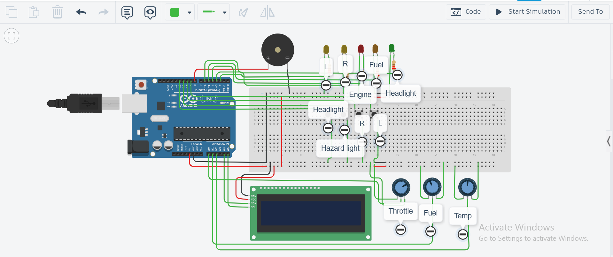

# 🔧 Hardware

OpenCluster is built using readily available development hardware to simulate the behavior of an automotive instrument cluster. While simplified compared to a production vehicle, the hardware provides an excellent platform for learning embedded systems concepts and rapid prototyping.

---

# Hardware Overview

The system consists of four main parts:

- Microcontroller
- Display
- Input Devices
- Output Devices

Together, these components simulate how a vehicle dashboard receives, processes, and displays information.

---
## Hardware Setup



---
# Hardware Architecture

```text
                 User Inputs
          (Potentiometers / Buttons)
                      │
                      ▼
              Arduino Uno (ECU)
                      │
        ┌─────────────┴─────────────┐
        ▼                           ▼
    LCD Dashboard              Warning Outputs
                             (LEDs / Buzzer)
```

The Arduino Uno acts as the central Electronic Control Unit (ECU), processing all simulated vehicle data before updating the dashboard.

---

# Components

## Arduino Uno

The Arduino Uno serves as the primary controller for OpenCluster.

### Responsibilities

- Reads sensor inputs
- Stores vehicle data
- Executes dashboard logic
- Runs the warning manager
- Updates the display

---

## 16×2 I2C LCD

The LCD represents the vehicle's instrument cluster.

### Displays

- Vehicle speed
- Engine RPM
- Fuel level
- Engine temperature
- Active warning messages

Using an I2C interface reduces wiring complexity and leaves additional GPIO pins available for future expansion.

---

## Potentiometers

Potentiometers simulate analog vehicle sensors.

Current uses include:

- Vehicle speed
- Fuel level
- Engine temperature

Rotating a potentiometer changes the corresponding simulated sensor value.

---

## Push Buttons

Push buttons simulate driver interactions with the dashboard.

Depending on the software version, they may be used for:

- Turning indicators on and off
- Changing dashboard screens
- Acknowledging warnings
- Navigating menus

Future versions may support additional driver controls.

---

## LEDs

LEDs simulate dashboard warning indicators.

Possible indicators include:

- Low fuel
- High engine temperature
- Turn indicators
- System status

Using dedicated LEDs makes warning conditions easier to observe during testing.

---

## Buzzer

The buzzer provides audible feedback for critical vehicle warnings.

Current warning events include:

- Overspeed
- High engine temperature
- Low fuel

Different warning patterns can be used to distinguish between events.

---

# Pin Assignment

| Component | Arduino Pin |
|-----------|------------:|
| LCD (I2C) | SDA / SCL |
| Speed Input | A0 |
| Fuel Input | A1 |
| Temperature Input | A2 |
| Buzzer | D8 |
| LEDs | Configurable |
| Buttons | Configurable |

> **Note:** Pin assignments may vary slightly between project versions.

---

# Power Requirements

The project is powered through the Arduino Uno using either:

- USB
- External 5V supply

Typical current consumption is well within the limits of standard Arduino operation.

---

# Design Considerations

Several design decisions were made to keep the hardware simple while maintaining flexibility.

### Why Arduino?

- Widely available
- Beginner-friendly
- Excellent ecosystem
- Ideal for rapid prototyping

---

### Why an I2C LCD?

- Reduced wiring
- Lower GPIO usage
- Simple integration
- Easily replaceable with future displays

---

### Why Potentiometers?

Real vehicles obtain data from sensors connected to ECUs.

Potentiometers provide an inexpensive way to simulate continuously changing sensor values during development.

---

# Future Hardware Upgrades

The current hardware platform serves as the first stage of the project.

Planned upgrades include:

- STM32 microcontroller
- CAN Bus transceiver
- CANable interface
- Physical ECU network
- OLED or TFT dashboard
- Rotary encoder
- Real automotive switches
- Additional sensors

These upgrades will move OpenCluster closer to the architecture found in modern vehicles.

---

# Summary

OpenCluster demonstrates that a relatively simple hardware setup can effectively model many of the concepts found in automotive instrument clusters.

The modular hardware design also provides a clear migration path toward more advanced embedded platforms and real automotive communication networks.
